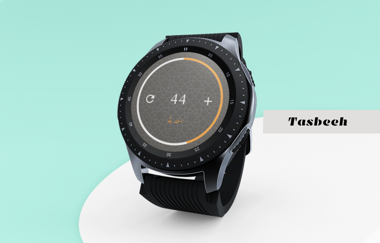
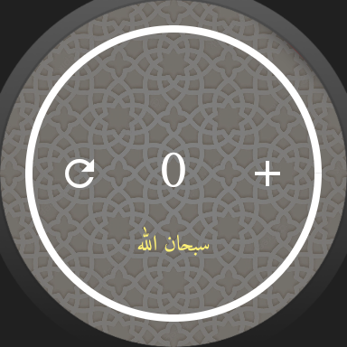
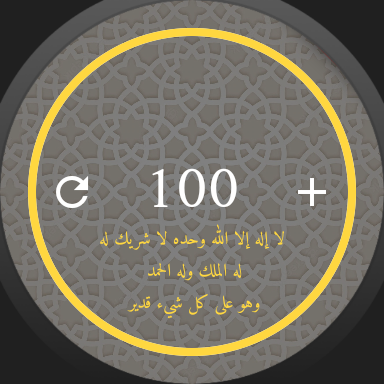
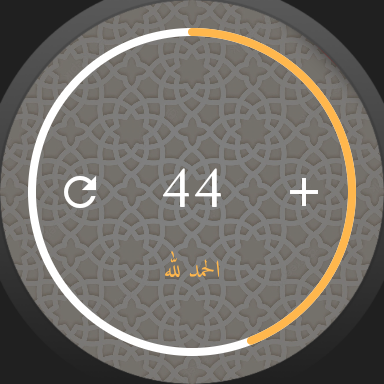

# Islamic Tasbihat Smartwatch App

Welcome to the Islamic Tasbihat Smartwatch App, a Flutter application designed to help you keep track of your tasbihat (Islamic supplications) conveniently on your smartwatch.
<!-- Give a width an hight -->

## Screenshots

Here are some screenshots of the Islamic Tasbihat Smartwatch App in action:

 
 
 

## Features

- **Easy Tasbih Counting**: This app allows you to easily count your tasbihat by tapping on the screen of your smartwatch.

- **Customizable Tasbih**: You can customize the tasbih you want to recite, and the app will keep track of the count for you.

## Getting Started

To get started with the Islamic Tasbihat Smartwatch App, follow these steps:

1. **Installation**: Install the app on your smartwatch using the provided installation instructions for your specific smartwatch model.

2. **Launch the App**: After installation, launch the app on your smartwatch.

3. **Choose Your Tasbih**: Select the specific tasbih you want to recite from the available options.

4. **Begin Counting**: Start counting your tasbih by tapping the screen of your smartwatch.

5. **Reset**: If you need to reset the count, there is an option to reset it within the app.

6. **Finish**: When you have completed your tasbih, the app will display a summary of your recitation.

## License

This project is licensed under the MIT License - see the [LICENSE](LICENSE) file for details.

---

Thank you for using the Islamic Tasbihat Smartwatch App. We hope it helps you in your daily tasbih recitations. If you have any questions or need further assistance, please don't hesitate to reach out to us.
